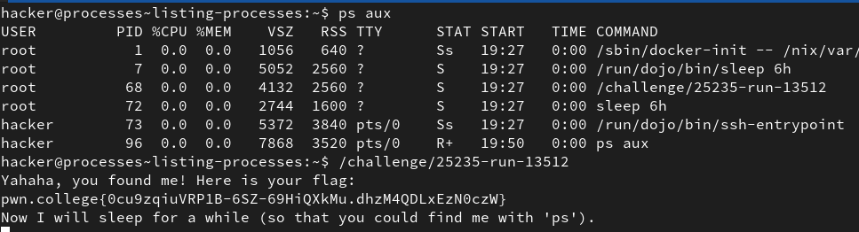
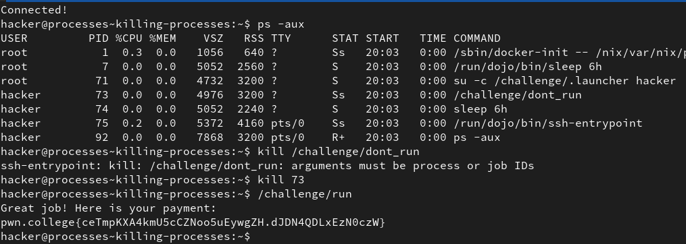
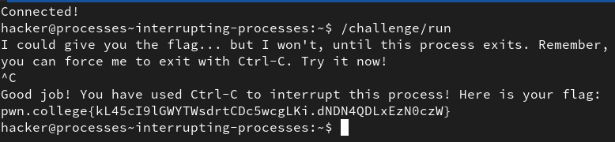
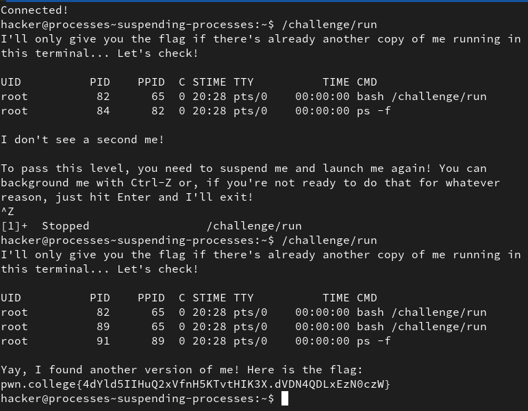
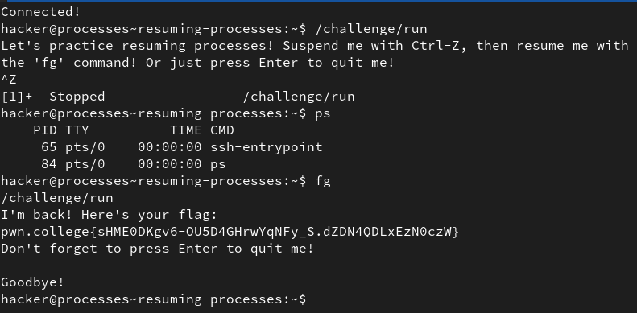
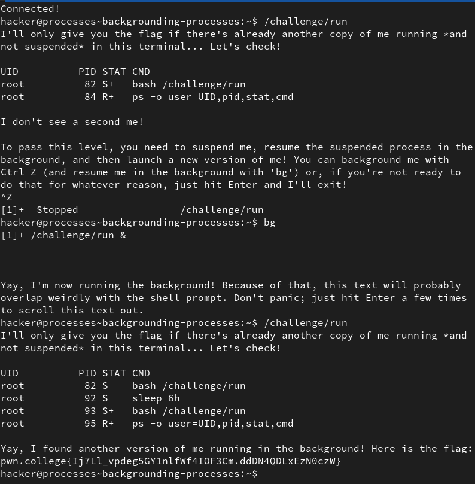
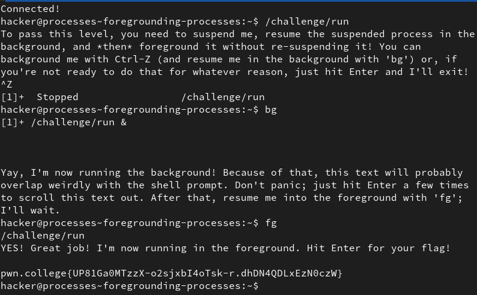
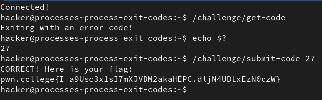

# Processes and Jobs

## 1. Listing Processes

The command `ps` lists the processes currenty running along with some details.  
`-ef` or `-aux`  are two option formats that display extra details and processes.  

1. `-e` - to list every process
2. `-f` - for full format output (including arguments) 

This combined gives `-ef` (standard format)
 

1. `-a` - to list all processes
2. `-u` - for user-readable output
3. `-x` - to list processes that arent running in a terminal

This combined gives `-aux` (BSD format)

Some parameters displayed by both commands:-

1. USER 
2. PID - Process ID (unqiue for every process)
3. TIME - CPU time used
4. TTY - terminal(if running on terminal)
5. CMD - the command

**Solution:**

## 2. Killing Processes

The `kill` command takes a number as an argument and kills the process that has a PID matching said integer. The way `kill` command works is, it does not instantly terminate the process but allows some final actions to complete before terminating.

**Solution:**

## 3. Interupting processes

There are some `control characters` that are key-combinations that when pressed, have some effect of the terminal. 
`Ctrl + c` interupts whatever process is running and ends it immediately.

**Solution:**

## 4. Suspending Processes

`Ctrl + Z` suspends a process without terminating it. Multiple instances of a process can run at the same time.

**Solution:**

## 5. Resuming Processes

The `fg` command resumes any suspended process in the foreground.  
Suspended processes do not show up in `ps` (when no options are given)

**Solution:**

## 6. Backgrounding Processes

The `bg` command is similar to the `fg` command except for the fact that it resumes the process in the background, allowing us to use our terminal while the process is running.

Foreground - running directly in the terminal, therefore we cant use the terminal normally.  
Background - running but allowing us to use our terminal normally.

**Solution:**

## 7. Foregrounding Processes

The `fg` command also brings any process running in the background to the foreground.

**Solution:**

## 8. Starting background processes

Adding an `&` after a command starts it running in the background, without having to **suspend** it and then use the `bg` command.

**Solution:**

## 9. Process Exit Codes

Every process when finished executing returns an exit code. Typically  an exit code of `0` implies the process ran succesfully and any other implies the process ran into an error, which can be identified by the exit code. 

The exit code of the most recent process is stored in a variable `?`

`echo $?` gives us the value of `?`,i.e. the last exit code.

**Solution:**

