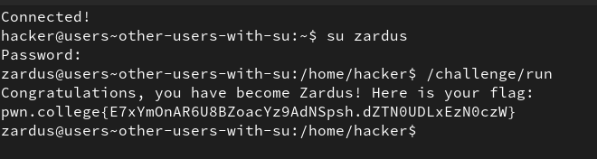
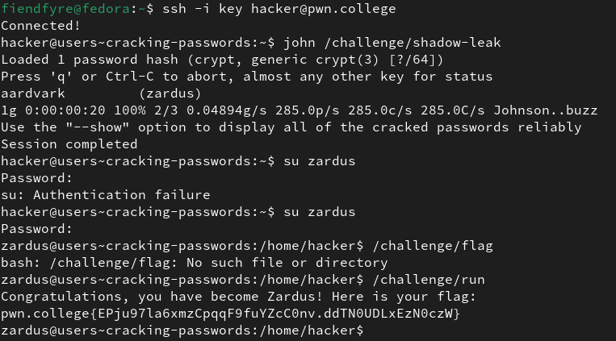
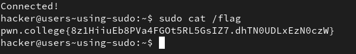

# Untangling Users

## 1. Becoming root with su

This level requires us to use the `su` command to swicth user to root. 

`su` with no argument starts a root shell.

It requires a password `hack-the-flag` to authenticate the command.

**Solution:**

`su` 
input - `hack-the-flag`  
`cat /flag`

## 2. Other users with su

In this level we use the `su` command to switch to a user that is not root. We require a password to switch as well, to autherntica our access to said user. the password here is `dont-hack-me`.

`su [user_name]`

**Solution:**

## 3. Cracking Passwords

This level makes use of the fact that every user's password is stored in a file called `etc/shadow` and is one-way-encrypted.

A value of `*` or `!` functionally means that password login for the account is disabled, a blank field means that there is no password.

Using the command `john` we can give it the password file as an argument, and it will scan through and decode the password.

**Solution:**

## 4. Using sudo

adding `sudo` before a command runs it as if it was by the root user. But only if the user using it has sudoer priveleges. 

**Solution:**

