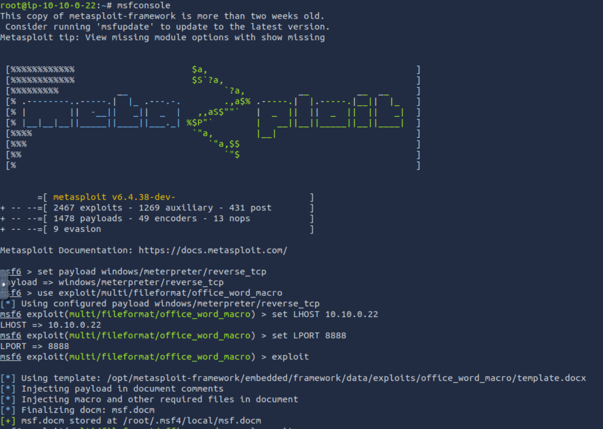
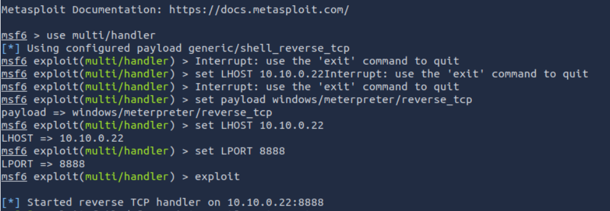
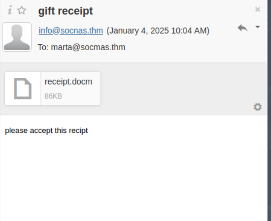

# DAY 10

```THM{PHISHING_CHRISTMAS}```

Crafting the document using metasploit


setting up a listener for any response /connection from the target



emailing the document to the target



after getting reverse shell, use `cat flag.txt`  to get the flag.