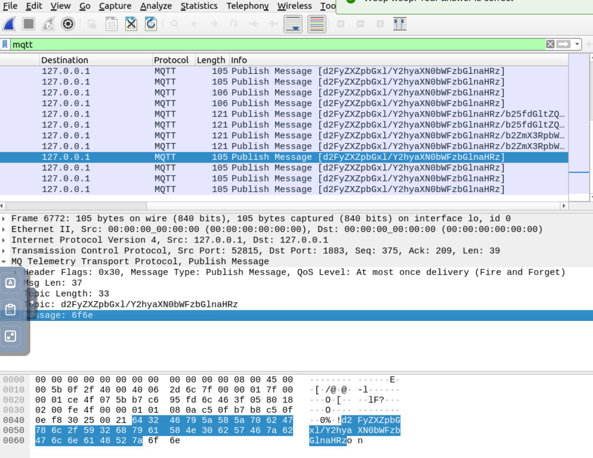
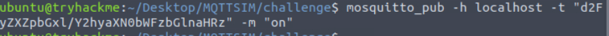
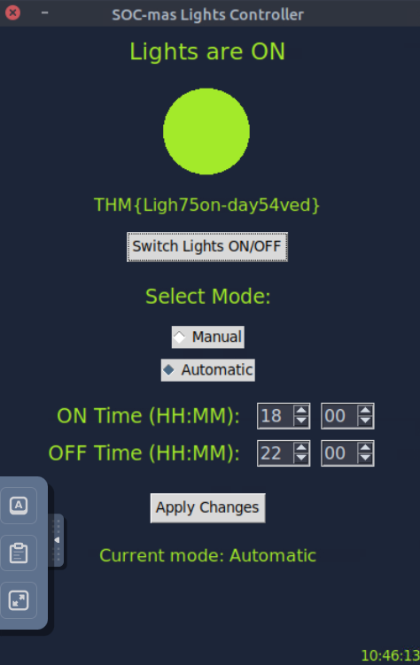

# DAY 24

This challenge require wireshark and some basic looking around to find the correct topic and message that can be used with mosquitto


```THM{Ligh75on-day54ved}```

Finding the message and topic



publishing a message using mosquitto, setting the broker to localhost



