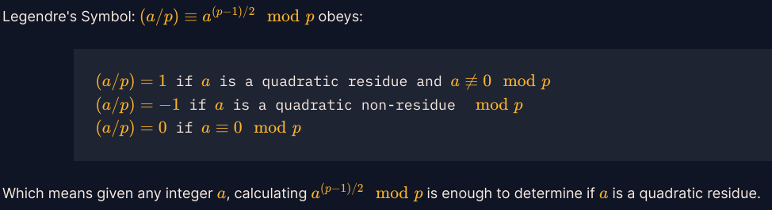

## Euclidean Algorithm for GCD

### Code

```python
def GCD(a,b):
    if a==0:
        return b
    else:
        return GCD(b%a,a)   
    
a=66528
b=52920
    
print(GCD(a,b))
```


## Extended Euclidean Algorithm 

The extended Euclidean algorithm is an efficient way to find integers `u` , `v` such that  ```a ⋅ u + b ⋅ v = gcd(a,b)```


### References:- 

 https://web.archive.org/web/20230511143526/http://www-math.ucdenver.edu/~wcherowi/courses/m5410/exeucalg.html

 https://www.geeksforgeeks.org/euclidean-algorithms-basic-and-extended/

 

### Code

```python
def gcdExtended(a,b):

    if a == 0:
        return b, 0 , 1
    
    gcd, x1, y1 = gcdExtended(b%a, a)

    x = y1 - b//a * x1
    y = x1

    return gcd, x, y

a, b = 26513,32321

gcd, x, y = gcdExtended(a,b)

print(f"gcd: {gcd}, s: {x}, p: {y}")
```

## Modular Arithmetic 1

two integers are congruent modulo `m` if `a ≡ b mod m.`

Another way of saying this, is that when we divide the integer `a` by `m`, the remainder is `b`.

$11 ≡ x \mod 6$ <br>
$8146798528947 ≡ y \mod 17$

To find: minimum of $x, y$

### Code

```python
print(min(8146798528947 % 17, 11 % 6 ))
```

## Modular Arithmetic 2

Fermat's Little Theorem

Fermat's little theorem is a fundamental theorem in number theory that states that if `p` is a prime number and `a` is an integer, then 
```
a ^ p ≡ a mod p
a ^ p-1 ≡ 1 mod p
```

## Modular Inverting

For all elements `g` in the field, there exists a unique integer `d` such that `g * d ≡ 1 mod p`

### Code

```python
def inverse(g,p):
    return pow(g,p-2,p)
```

## Quadratic Residues

In number theory, a quadratic residue is an integer that is congruent to a perfect square modulo another integer. In other words, an integer \(q\) is a quadratic residue modulo \(n\) if there exists an integer \(x\) such that $x^2 \equiv q \mod n$. If there is no solution to this congruence, then \(q\) is a quadratic nonresidue modulo \(n\)

### Code

```python
def root(num,p):
    for x in range(p):
        if pow(x,2,p) == num:
            return x
    return 
```

## Legendre Symbol

### Some rules: 

$Quadratic Residue * Quadratic Residue = Quadratic Residue$ 

$Quadratic Residue * Quadratic Non-residue = Quadratic Non-residue$

$Quadratic Non-residue * Quadratic Non-residue = Quadratic Residue$



### Code

```python
# Legendre Symbol check
def check_square(num,p):
    if pow(num,(p-1)//2, p) == 1:
        return True
    else: 
        return False

# works when p ≡ 3 mod 4
def root(num,p):
    x = pow(num, (p+1)//4, p)
    return [x,(-x)%p]
```

