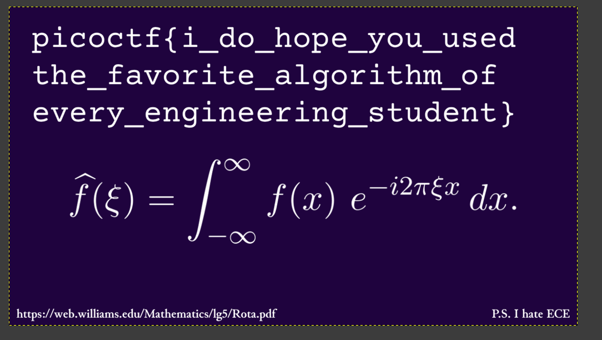

# Flag_Printer

**Flag:** `picoCTF{i_do_hope_you_used_the_favorite_algorithm_of_every_engineering_student}`

- **step 1**

    The original program was calculating the solution `Z` to `A * Z = Y`

    It was very inefficent, since it wasnt taking into account the special properties of the matrix A (A is a Vandermonde Matrix)

    Instead, this was a polynomial interpolation question.

    A primary finite field was also used with a mod of `7514777789`

    The solution was to simply make the program faster.

    I used sage and recursive FFT to solve this.

    The program still took 5 hours to run.


    ```python
    p = 7514777789

    X = []
    Y = []
    for line in open('encoded.txt', 'r').read().strip().split('\n'):
        x, y = line.split(' ')
        X.append(int(x))
        Y.append(int(y))

    K = GF(p)
    R = PolynomialRing(K, 'x')

    def compZ(X):
        x = R.gen()
        Z = K(1)
        for xk in X:
            Z *= (x-xk)
        return Z

    def comp(X, Y, X2):
        Z = compZ(X2)
        Y = [y/Z(x) for x, y in zip(X, Y)]
        return Y, Z

    def solve(X, Y):
        n = len(Y)

        if n <= 10:
            return R.lagrange_polynomial(list(zip(X, Y)))

        m = n // 2

        X1 = X[:m]
        Y1 = Y[:m]
        X2 = X[m:]
        Y2 = Y[m:]


        if m > 10000:
            result1 = comp(X1, Y1, X2)
            result2 = comp(X2, Y2, X1)

            Y1, Z2 = result1
            Y2, Z1 = result2
        else:
            Y1, Z2 = comp(X1, Y1, X2)
            Y2, Z1 = comp(X2, Y2, X1)


        f1 = solve(X1, Y1)
        f2 = solve(X2, Y2)


        return f1*Z2 + f2*Z1

    f = solve(X, Y)

    open("output.bmp", "wb").write(bytearray(f.coefficients(sparse=False)[:-1]))


    ```

    This gave me a bmp file which i opened using GIMP

    


**What I learned:**

1. About fields
2. About interpolation, Vandermonde Matrix
3. More about sage and I installed sage usinf conda to run the above script.

**Other incorrect methods I tried:**

- I tried using multiprocessing for the original program but it still took too long (12+ hours)

**References**

- https://www.naukri.com/code360/library/galois-field-in-cryptography
- https://people.csail.mit.edu/madhu/ST12/scribe/lect06.pdf 
- Modern Computer Algebra by Joachim von zur Gathen (Available for free on Anna's Archive)