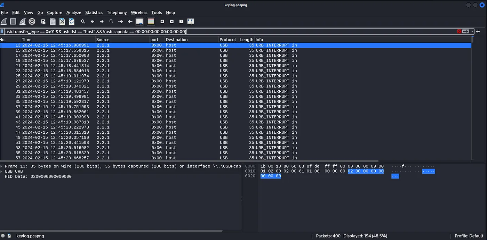

# I am wired in

I found a `keylog.pcapng` file.

Using this reference (https://abawazeeer.medium.com/kaizen-ctf-2018-reverse-engineer-usb-keystrok-from-pcap-file-2412351679f4) and following the exact steps, I got the flag.

Flag - ```BITSCTF{I_7h1nk_th3y_4Re_k3yl0991ng_ME!}```

The filters:-



script for converting the hex values to characters.

```python
newmap = {
    2: "PostFail", 4: "a", 5: "b", 6: "c", 7: "d", 8: "e", 9: "f", 10: "g",
    11: "h", 12: "i", 13: "j", 14: "k", 15: "l", 16: "m", 17: "n", 18: "o",
    19: "p", 20: "q", 21: "r", 22: "s", 23: "t", 24: "u", 25: "v", 26: "w",
    27: "x", 28: "y", 29: "z", 30: "1", 31: "2", 32: "3", 33: "4", 34: "5",
    35: "6", 36: "7", 37: "8", 38: "9", 39: "0", 40: "Enter", 41: "esc",
    42: "del", 43: "tab", 44: "space", 45: "-", 47: "[", 48: "]", 56: "/",
    57: "CapsLock", 79: "RightArrow", 80: "LeftArrow"
}

myKeys = open('hexoutput.txt')
i = 1
for line in myKeys:
    bytesArray = bytearray.fromhex(line.strip())
    for byte in bytesArray:
        if byte != 0:
            keyVal = int(byte)
            if keyVal in newmap:
                print(newmap[keyVal])
            else:
                print("No map found for this value:", keyVal)
    i += 1
```
