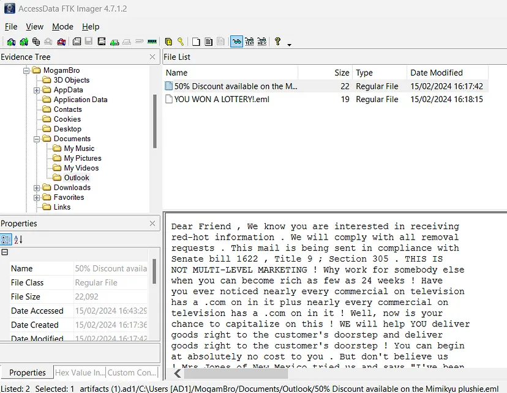
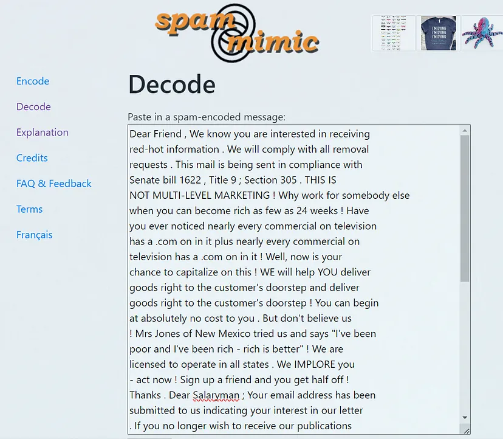

# MogamBro's Guilty Pleasure

Flag - ```BITSCTF{sp4m_2_ph1sh_U}```

Looking through the emails, two were there



One of them contained a spam message, which I  copy pasted into google



I found this site (https://www.spammimic.com/)

using which i decoded the spam message and got the flag ```BITSCTF{sp4m_2_ph1sh_U}```