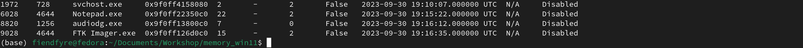

```bash
vol -f ./memdump.mem windows.pslist
```



Notepad has a PID of 6028 

```bash
 vol -f memdump.mem windows.memmap --pid=6028 --dump
```

dump file for the notepad process


strings gave partial flag but not complete, flag must be in multiple lines

Printing the next few lines and we get the whole flag


Flag - `BHflagY{d22a 3  e e d 0  5 0  c 2  3 c  0 8  8 0  c c  9 1  2 3  6 8 9 0  5  c  9  d 2 5  2 7 a  4 1 c 3 2 8  f 8 1  e f  1 1  5 b  9  4 64 b  8 0  0f 7 42 5 33 3 edb7 1d5  7b4 40b  94 d c 7  6 6a 2d 4 9 61 1 d4  69 68 47  7b09dfa1  f246585d  8 7d 7b 5 a}`

