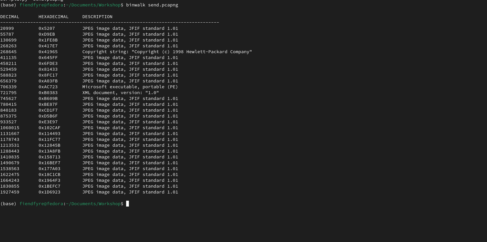
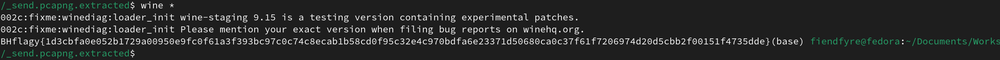

There are many URB_BULK_OUT packets, and one of them is a PE.



```binwalk --dd='.exe' send.pcapng```

to extract the pe.

strings gave me nothing so i tried running it

I used wine to run the PE 



Flag - ```BHflagy{1d3cbfa0e052b1729a00950e9fc0f61a3f393bc97c0c74c8ecab1b58cd0f95c32e4c970bdfa6e23371d50680ca0c37f61f7206974d20d5cbb2f00151f4735dde}```

