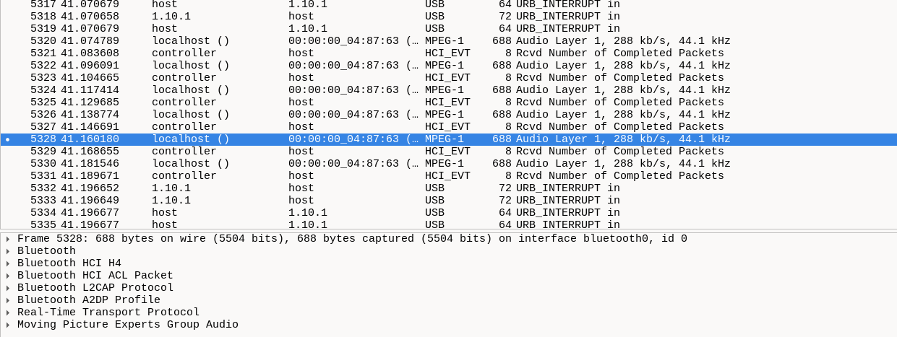
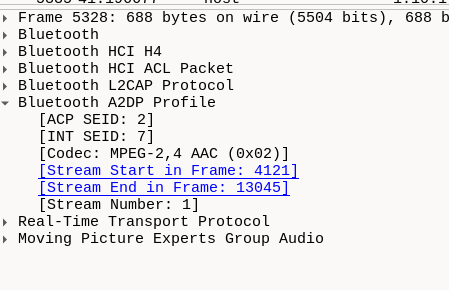

there was some type of audio package being recieved 

googling the various different protocols present, I found out this article - https://stackoverflow.com/questions/35915317/decode-mpeg-2-4-aac-lc-latm-bitstream-for-a2dp

which seemed to have the same type of bitstream



Looking for a way to decode such data, I found this
https://github.com/dhavalbc/MPEG2-4-AAC-DECODER

extract the data using tshark( and a little AI)

```bash
tshark -r release-7ecaf64448a034214d100258675ca969d2232f54.pcapng -T fields -e data.data | sed '/^\s*$/d' > out.txt
```
then 
```python
f = open('1.txt').readlines()
with open('data.latm','wb') as ff:
    for i in f:
        dataa = bytes.fromhex("FFF1108052DFFD") + bytes.fromhex(i[24:])
        ff.write(dataa)
ff.close()
```

Here, FFF1108052DFFD is used to fill in the adts header and the original header is removed.

Then we get a complete AAC bitstream in adts format.

However tshark wasnt extracting any data.


