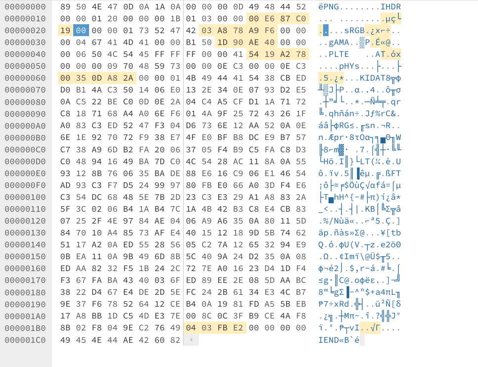

# Check Research and Check Again

**Flag:** `0ctf{crc_1s_a_us5ful_m5chan1sm}`

### How to solve

The png file had a lot of corrupted bits, mostly the crc value for each chunk. Looking for png analysers online, I found a very useful website (https://www.nayuki.io/page/png-file-chunk-inspector) which gave me all the clues I needed to solve this challenge. 

Using https://hexed.it/ I was able to make the necessary modifictions and get the flag.

**What I learned:**

1. How to modify hex data of an image and different parts of image header.

**Other incorrect methods I tried:**

- None

**References**

- None

