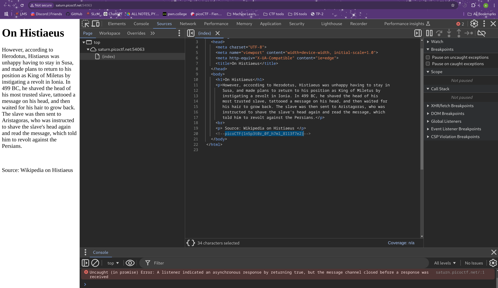

# Inspect HTML

**Flag:** `picoCTF{1n5p3t0r_0f_h7ml_8113f7e2}`

- **step 1**

    I Inspected the webpage and checked sources (which lists the viewable code that makes the webpage).

    

**What I learned:**

1. Right clicking and inspecting a web page allows me to see the html file and the code for each element. Depending on the website I might even be able to view the JS and CSS files, along with more information about the website such as cookies.

**Other incorrect methods I tried:**

- None

**References**

- None

