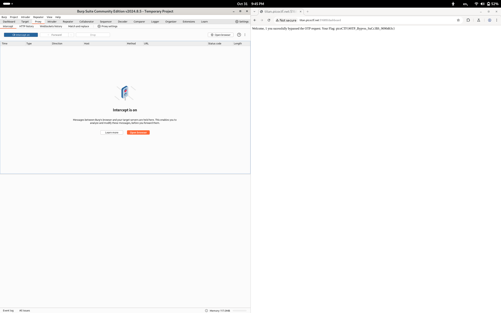

# Intro To Burp

**Flag:** `picoCTF{#0TP_Bypvss_SuCc3$S_9090d63c}`

- **step 1**

    Using burp proxy, i turned intercept on and entered the url provided by picoctf, after forwarding a couple times since there was nothing intreseting in the intecepted requests, it opens the login page. I entered random details and clicked next. 

- **step 2**

    This took me to the OTP page, where i entered the OTP. as long as i put some value, i always reached the OTP page. Then i tried putting otp as admin, flag, pico, etc and none worked, then i deleted the cookie entirely. This somehow worked and i got the flag.

    

**What I learned:**

1. Basics of Burp Proxy and network requests.
2. Cookies and how they are essential in requests.

**Other incorrect methods I tried:**

- I tried a variety of different combinations for the first login page, but that page didnt matter.

**References**

- [Burpsuite tutorial for intercepting HTTP traffic with Proxy](https://portswigger.net/burp/documentation/desktop/getting-started/intercepting-http-traffic)

