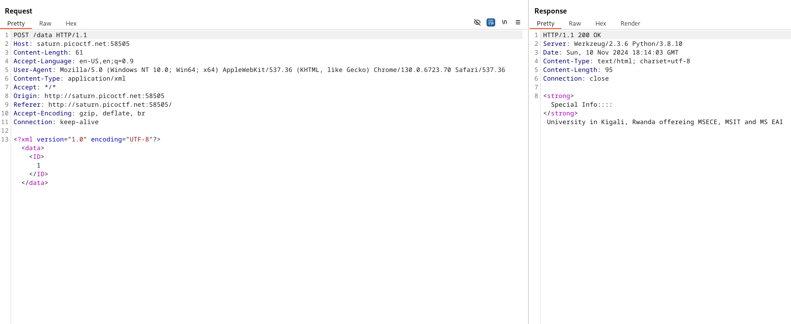
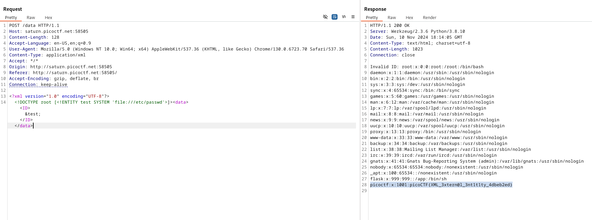

# SOAP

**Flag:** `picoCTF{XML_3xtern@l_3nt1t1ty_4dbeb2ed}`

- **step 1**

    The challenge tag mentions xxe and the file `/etc/passwd`

    The following request was generated upon clicking details in the website.

    

    Modifying it to request the etc/passwd file instead gave the flag.

    

**What I learned:**

1. XML and SOAP, potential vulnerabilties.

**Other incorrect methods I tried:**

- None

**References**

- https://github.com/swisskyrepo/PayloadsAllTheThings/blob/master/XXE%20Injection/README.md