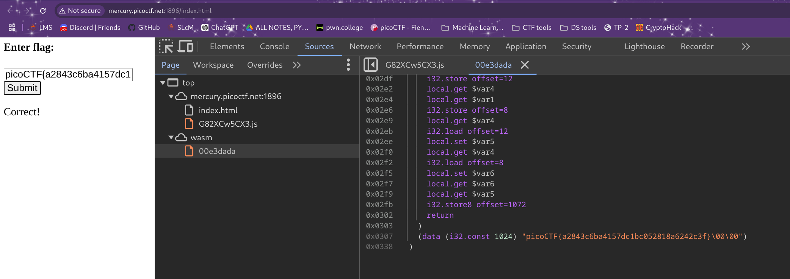

# Some assembly required 1

**Flag:** `picoCTF{a2843c6ba4157dc1bc052818a6242c3f}`

- **step 1**

    The name of the challenge hinted at something to do with assembly. Looking at the sources of the webpage inside the developer console led me to a wasm folder which i found our was short of web assembly. This scrolling through the file that was present in the wasm folder gave me the flag, it was located at the bottom. There was also something related to `strcmp`, which im guessing relates to the text box and the input there is being compared to the flag present in this file

    

**What I learned:**

1. Web Assembly and its purpose.

**Other incorrect methods I tried:**

- I first tried to de-obfuscate the javascript file, but it was time-consuming and very useless. It had one part that was fetching something from an address and had to do with web assembly whcih was interesting because the challenge name had the word assembly in it, but it was unnecessary since the flag was in the file itself and could be gotten directly. 

**References**

- https://developer.mozilla.org/en-US/docs/WebAssembly

