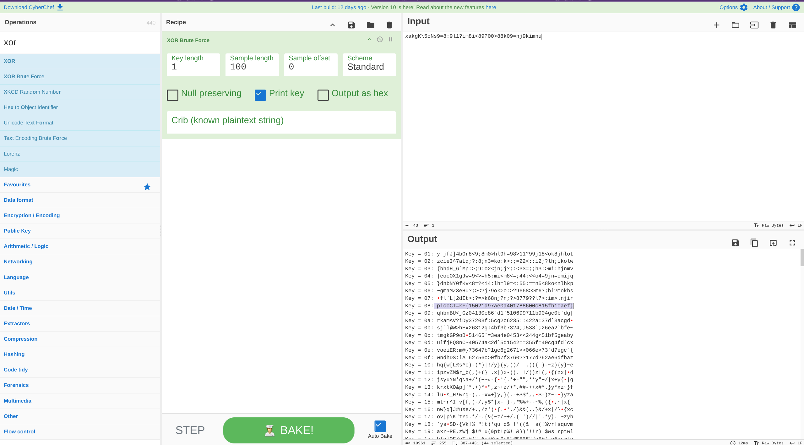

# Some assembly required 2

**Flag:** ` picoCTF{15021d97ae0a401788600c815fb1caef}`

- **step 1**

    Similar to the previous challenge, this challenge had encrypted text in the same wasm file. I tried different encodings on it and XOR worked. That gave me the flag.

    

**What I learned:**

1. NA

**Other incorrect methods I tried:**

- None

**References**

- None

