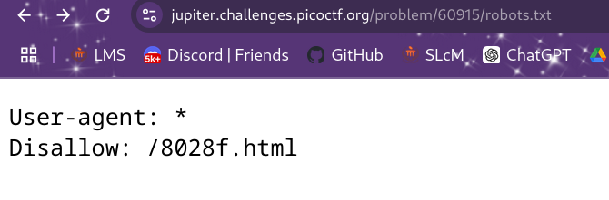
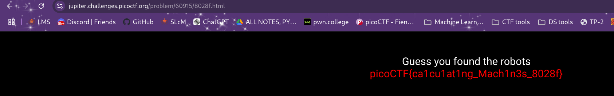

# Where are the robots

**Flag:** `picoCTF{ca1cu1at1ng_Mach1n3s_8028f}`

- **step 1**

    The name of the challenge hints at something to do with robots so i checked if the wbepage had a robots.txt file (which is often included to tell web-crawlers what they are allowed to access and which they arent).

    

- **step 2**

    This gave me a clue of a path `/8028f.html` . Going to that path gives the flag.

    

**What I learned:**

1. The robots.txt file and its use.

**Other incorrect methods I tried:**

- None

**References**

- None

