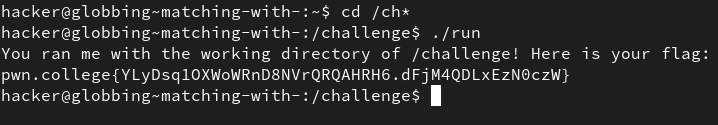
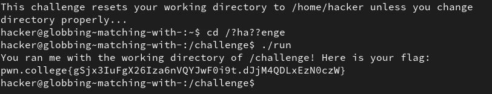
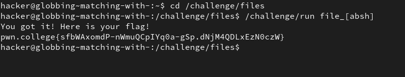
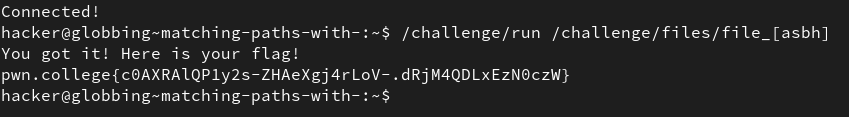
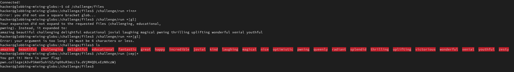
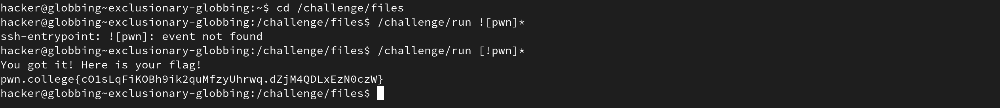

# File Globbing

## 1. Matching with *

*Using regex can make searching for files with partial name easier, or for searching with some common parts in their name/common pattern. In simpler terms it acts as a list of all locations that match the specified pattern.* 
*In this level, `/ch*` keeps with the limit of 4 characters and can match the required directory `challenge` because * is a wildcard that can be subtituted by any number of characters.*

**Solution:**

## 2. Matching with ?

*Each `?` is a wildcard that represents any ONE character, not including spaces.*

**Solution:**

## 3. Matching with []

*`[ab]` is like a `?` that only matches `a` or `b` and no other character. In this level we can use `file_[absh]` to any files that match the following list of names (file_a, file_b, file_s, file_h)*

**Solution:**

## 4. Matching paths with []

*Just like `[]` can be used as a wildcard in file_names, it can also be used to match multiple paths.*

**Solution:**

## 5. Matching globs

*After a few tries with different combinations of special characters, i used ls(i should have in the start) and realised that every file has a different starting letter. So to match the files i wanted, i used square bracket to specify that starting character must match `c`,`e` or `p`, and put a `*` at the end to represent the rest of the name. This gave the flag.*

**Solution:**

## 6. Exclusionary globbing

*Using the `!` speical character to reverse the effect of the square brackets, so instead of matching files that contain the characters **p,w,n**  it instead matches all files that didnt start with p,w,n.*

**Solution:**

