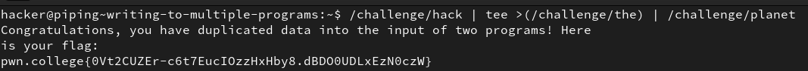

# Practicing Piping

## 1. Redirecting Output

This level requires us to redirect a string ouput of a command into a file using `>`. WARNING - this replaces any existing data in the file.*<br>
*`echo` is a simple command that takes a string argument and outputs the exact same string. We use this command to easily get the string output we want, which is `PWN`. 

**NOTE:**

1. Format for `>`

    **Command with some output** `>` **File where the output is to be redirected.**

<br>

2. Use `>>` to append data instead of replacing.

<br>

**Solution:**


## 2. Redirecting more output

In this level we redirect the output of `/challenge/run` into the **myflag** file. HOWEVER, only the **stdout** <u>stream</u> of the output is redirected to the file. The **stderror** <u>stream</u> is printed onto the terminal because by default, `>` only redirects **stdout** <u>stream.</u>

**Solution:**


## 3. Appending Output

`>>` appends the commands output to the file instead of replacing the file's pre-existing data

**Solution:**


## 4. Redirecting Errors

We can redirect the different output streams of a command to multiple files in the same line. It supports ONE input and MULTIPLE outputs. The same stream cant be redirected to multiple files

**NOTE:**

The different streams are:-

1. stdin - standard input with a file desrciptor of 0
2. stdout - standard output with a file descriptor of 1
3. stderr - standard error with a file descriptor of 2

Equivalent redirection operators:-
1. stdin - `<`
2. stdout - `1>` OR `>` (it is the default)
3. stderr - `2>`

**Solution:**


## 5. Redirecting input

This level has two steps. Step 1 requires us to use the `touch` command or redirect the word **CHALLENGE** into the **PWN** file. Step 2 requires us to redirect the files contents as the input of `/challenge/run` command. Doing this correctly gives the flag.

**Solution:**


## 6. Grepping Stored Results

*This level had two steps. Step 1 was to redirect the output of the `run` command to a **.txt** file. Second step was to grep the **.txt** file to find the flag.*

**Solution:**

```/challenge/run > /tmp/data.txt```<br>
```grep pwn.college /tmp/data.txt```


## 7. Grepping Live Output

`|` can be used to pip the output of the command on its left to the input of the command on its right. creating a sort of chain of commands so there is not need to create files and store the intermediate outputs. Here we pipe the output of `/challenge/run` to the input of `grep`, and we can also add another argument to grep manually which is `pwn.college` to find the flag.

**Solution:**

```/challenge/run | grep pwn.college```


## 8. Grepping errors

In this level we learn about the `>&` operator, which redirects a file-descriptor to another file-descriptor, i.e. making data of one stream behave like another. Here we redirect **stderr** to **stdout** to combine both to get one output that can be grepped easily.

**Solution:**

```/challenge/run 2>&1 | grep pwn.college```


## 9. Duplicating piped data with tee

In this level we took the two outputs of `tee`, one of them being **stdout**, and one being a redirect to a file. The **stdout** gets **piped** further into the next command. `cat` ing the file where `tee` redirected the output of the previous command to gives us the instructions needed to run the final command to get the flag. 

**Solution:**


## 10. Writing to multiple programs

This level teaches us the Linux ideology that **everything is a file**. It shows us a way to use the redirect operator in a similar manner to piping, a process called <u>**Process Substitution**</u>.

**Solution:**


## 11. Split-piping stderr and stdout

After a few tries, I realised the trick was to simply redirect the diff file-descriptors without converting stderr to stdout to the respective commands.

**Solution:**

```/challenge/hack > >(/challenge/planet) 2> >(/challenge/the)```
<br>OR <br>
```/challenge/hack 2> >(/challenge/the) | /challenge/planet```


