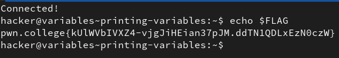
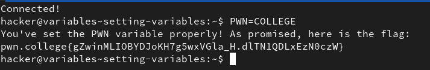
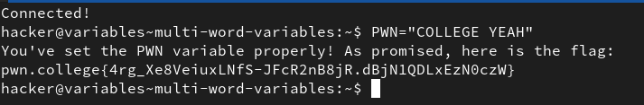
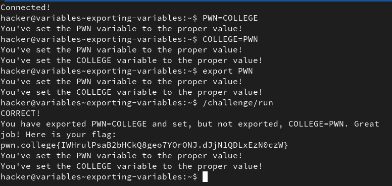
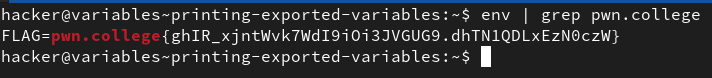
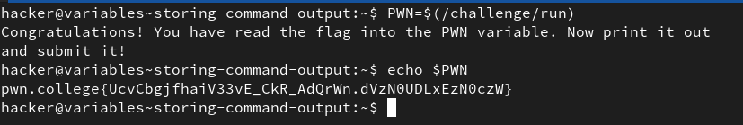
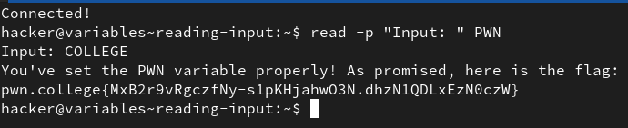
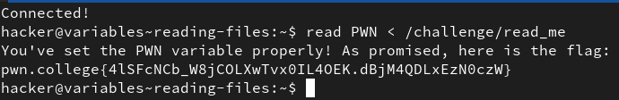

# Shell Variables

## 1. Printing Variables

This module introduces us to shell scripting and shell variables in particular. Variables can be printed by prepending `$` to the start of their name, which refers to their value.

`echo $var_name` prints the value contained in the variable named var_name onto the terminal.

**Solution:**

## 2. Setting Variables

Variables can be set using the format `VAR=value` with no spaces anywhere. Variables and their values are case sensitiive.

**Solution:**

## 3. Multi-word variables

Variables with a value of multiple words (i.e. having spaces in it) can be represented by wrapping the whole string in double quotes.
ex. `VAR="word1 word2 word3"`

**Solution:**

## 4. Exporting Variables

`export VAR` makes the variable VAR available for use/accesible by other commands. By default a variable is not an environment variable.

## 5. Printing Exported Variables

`env` prints every environment variable and their value. using piping and `grep` we can find the flag from the output of `env`.

**Solution:**

## 6. Storing Command Output

we can use the format `VAR=$(some_command)` to store the output of `some_command` to the variable VAR.

**Solution:**

## 7. Reading Input

`read` is a command that takes input from the user and stores it in a variable. `-p` option can be used to specify a prompt for the user. 

`read -p "Prompt_here" VAR_NAME`

**Solution:**

## 8. Reading Files

The `read` command can also be used to read entire files into a variable using the stdin redirection operator `<`.

`read VAR_NAME < File`

**Solution:**

