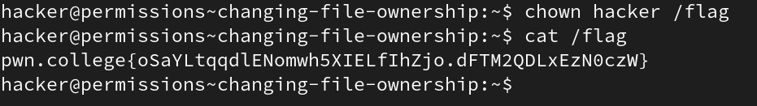
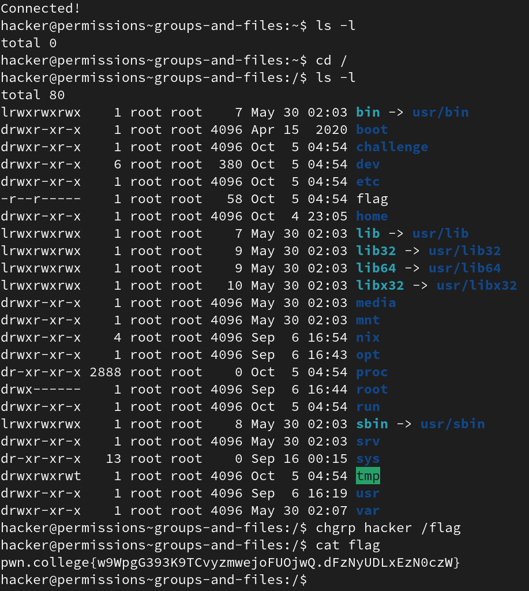
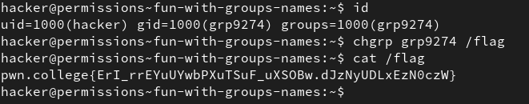
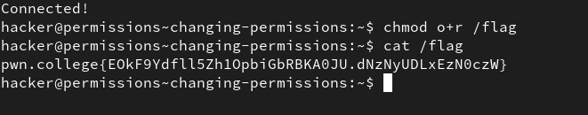
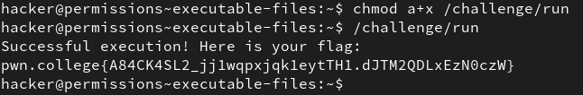
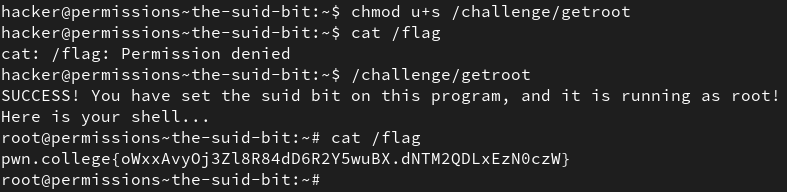

# Perceiving Permissions

## 1. Changing File Ownership

In this level, we use the `chown` command to change the ownership of a file to a different user.

Two very important user accounts:-
1. Root - The administrative account with complete control
2. Hacker - my user account.

Every file has a file-type as well the permissions that USER, GROUP, OTHERS have. 

Each one of them can have a combination of read, write, execute privileges or could have none.

`chown user_name file_path`

**Solution:**

## 2. Groups and Files

`chgrp` changes the group that owns a file.

**Solution:**

## 3. Fun with Group names

The `id` command tells the user who invoked it what **groups** they are part of along with their **userid (UID)** as well as **groupid (GID)** for each group.

**Solution:**

## 4. Changing Permissions

The `chmod` command can change the permissions the user/group/other has for a file/directory. To change the permissions of a file, one must already have write privileges.

`chmod [-options] MODE file_name`

1. `r` - user/group/other can read the file (or list the directory)
2. `w` - user/group/other can modify the files (or create/delete files in the directory)
3. `x` - user/group/other can execute the file as a program (or can enter the directory, e.g., using `cd`)
4. `-` - nothing 

**Solution:**

## 5. Executable files.

Same as the previous level, except this time we are changing the permission of an executable file to make it executable by all.

**Solution:**

## 6. Permission Tweaking Practice

After changing permissions as per instructions a bunch of times, we get the flag.

## 7. Permissions Setting Practice

`chmod` can directly set permissions rather than modifying them using `=` rather than `-`. 

We can also chain modes together using `,`

ex: `chmod u=wx,g=r,o=x file` results in `-wxr----x`

Doing this repeatedly as per insutructions solves this level.

## 8. The SUID Bit

The **SUID** (Set User Id) bit makes it so that no matter which user executes the program, the program executes as the owner user, provided the invoking user has executable permission.

We can set the **SUID** bit using `chmod` as shown in the solution below.

